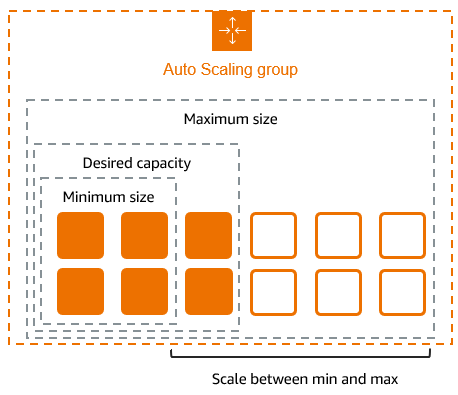

# Amazon EC2 Auto Scaling Group

## Características principales

* Colección de instancias EC2 controladas por el servicio que permite gestionar el número de EC2 en función de la carga que tenga la aplicación.
* Mediante políticas podemos definir cuándo se escalarán o desescalarán instancias EC2.
* Cuando actualizamos el ASG como por ejemplo, la launch template, las instancias en ejecución no obtendrán los cambios.
* Es posible actualizar - reemplazar - una instancia usando instance refresh.
* Podemos actualizar manualmente una instancia sin necesidad de tener que eliminarla de varias maneras:
    * Poner la instancia en modo standby.
    * Sacarla temporalmente del ASG y luego volver a unir.
* Podemos hacer uso de rollbacks y checkpoints en caso de actualizar las instancias en ejecución usando instance refresh.
* Podemos obtener el ID de la AMI mediante Amazon Systems Manager Parameter Store, aunque nos impedirá el uso de otras funcionalidades como el rollback.
* Mediante [Amazon Application Recovery Controller](https://docs.aws.amazon.com/autoscaling/ec2/userguide/ec2-auto-scaling-zonal-shift.html) para mover las instancias de una región con incidencias a otra.
* Es posible integrar el ASG con otros servicios como un ELB.
* Mediante instance maintenance policy es posible indicar cómo se irán creando y reemplazando las instancias.
* Para controlar cuando una instancia está lista para gestionar peticiones, tenemos:
    * Health checks
    * Instance warmup
* Es posible crear hooks para que se ejecuten cuando una instancia está en un estado concreto.
* Podemos usar Spot instance e indicar un porcentaje de instancias on-demand y spot que deseamos tener en nuestro ASG.
* Es posible usar distintos tipos de instancia en un mismo ASG, pudiendo dejar al propio ASG quien seleccione un tipo u otro o configurándolo nosotros manualmente.
* En caso de que nuestras instancias tarden bastante en iniciar, podemos hacer uso de warm pools para reducir drásticamente esos tiempos.

## General

* Esta funcionalidad permite tener un número determinado de instancias EC2 para gestionar la carga de la aplicación según la demanda que tenga.
* Auto Scaling groups es una colección de instancias EC2.
* Se establece un número mínimo y máximo de instancias EC2 a desplegar. Además, es posible definir un `desired capacity` y ASG tratará de levantar las instancias.
    * 
    * [Imagen](https://docs.aws.amazon.com/images/autoscaling/ec2/userguide/images/asg-basic-arch.png) explicativa del concepto.
* Si se especifican `scaling policies`, ASG levantará y terminará instancias según la demanda se incremente o reduzca.
* Podemos actualizar una instancia a modo de 'canary deployment' o incluso, ponerla en standby, lo que hará que no esté activa para los clientes, aunque podremos hacer troubleshooting en ella, hacer ajustes y luego, volver a ponerla en servicio.
* Podemos desplegar instancias on-demand y spot, incluso a la vez en el mismo ASG.
* Podemos usar distintos tipos de instancias y de opciones de compra en un mismo ASG.
* No es recomendable usar **$Latest** o **$Default** como valor a la hora de elegir la launch template, dado que habrá funcionalidades como rollback o skip matching que no estarán disponibles o que reemplazarán las instancias más veces de las deseadas.
* La funcionalidad [estas quotas](https://docs.aws.amazon.com/autoscaling/ec2/userguide/ec2-auto-scaling-quotas.html) aplicadas.
* Es posible desasociar una instancia del ASG y opcionalmente, volverla a incluir después.
    * Se recomienda ponerlas en modo **standby**.
    * En caso de no ajustar el **desired capacity**, ASG levantará otra instancia.
    * Sólo se puede hacer cuando están en estado **InService**.
* Hay ciertos requisitos a cumplir para unir una instancia auto-gestionada al ASG.
    * Debe estar **RUNNING**.
    * Su AMI debe existir.
    * Debe estar alojada en la misma región.
    * La AZ debe ser parte del ASG.
* Podemos usar [Amazon Application Recovery Controller](https://docs.aws.amazon.com/autoscaling/ec2/userguide/ec2-auto-scaling-zonal-shift.html) para mover las instancias de una región con incidencias a otra.
* Las estrategias de AZ para el ASG son:
    * **Balanced best effort**
        * ASG mantiene un número igual de instancias entre las AZs.
        * Si un launch falla en una AZ, ASG intentará crear la instancia en otra AZ.
    * **Balanced only**
        * Si un launch falla en una AZ, ASG seguirá tratando de crear la instancia en la misma AZ.
* Respecto a una instancia terminada:
    * Si tenía una EIP asociada, está no será eliminada del pool, por lo que si queremos usarla en otra instancia o eliminarla del pool, habrá que usar un hook.
    * Los volúmenes EBS asociado serán eliminados si dicha opción está definida, sino simplemente estarán disponibles pero sin usar.
* Es posible establecer establecer un periodo de vida máximo de una instancia.
    * Nos permite ir reemplazando instancias periódicamente reduciendo la necesidad de usar **instance refresh**.
    * No es recomendable establecer valores cortos, dado que puede verse afectado nuestro **desired capacity** y por ende la disponibilidad de la aplicación.
    * Podemos usar la opción **Instance scale-in protection** para garantizar que ciertas instancias no son eliminadas incluso si llegó el fin de la vida establecida.
    * Es importante definir una **instance maintenance policy** para tener el mayor control posible sobre como se escala y desescala.

## Funcionalidades

* `Monitorización del estado de las instancias`
    * Monitoriza la salud de cada instancia, en caso de que los health checks fallen, la eliminará y creará una nueva.
* `Custom health checks`
* `Balanceo de la capacidad entre múltiples AZs`
    * ASG trata de mantener un mismo número de instancias en cada AZ.
    * En caso de que no haya un balance de instancias entre las AZs, ASG tratará de corregirlo de dos vías:
        * **Availability zone balancing**
            * Lanzará nuevas instancias antes de terminar las antiguas, de modo que no se reduzca el rendimiento.
            * Es posible que se sobrepase la capacidad establecida hasta un 10%.
            * Podemos definir `instance maintenance policies` para controlar nosotros mismos el rango entre otras cosas.
        * **Capacity Rebalancing**
            * Sólo es válido para instancias Spot.
            * ASG tratará de crear nuevas instancias cuando se le reporte que una Spot instance tiene un elevado riesgo de interrupción.
* `Múltiples tipos y 'purchase' en un mismo ASG`
    * Es posible configurar instancias de tipo 'Spot' u 'On-Demand'.
    * Podemos hacer uso de instancias reservadas o Saving plans en combinación con On-Demand.
* `Remplazo automático de Spot instances`
    * Si se ven interrumpidas, ASG las remplazará
    * A través del 'capacity rebalancing' monitoriza y reemplaza instancias de tipo Spot que tienen un porcentaje elevado de ser interrumpidas.
* `Load balancing`
    * Se integra con el módulo de Elastic Load Balancing.
    * ASG registra o desuscribe las instancias del ELB.
* `Scalability`
    * A través de políticas es posible escalar o desescalar.
* `Instance refresh`
    * Si el launch template sufre cambios, podemos usar ese mecanismo para actualizar la instancia.
    * Se puede usar como un 'canary deployment', dado que permite modificar unas instancias y revisar el comportamiento antes de actualizar todo el scaling group.
* `Lifecycle hooks`
    * Permite ejecutar acciones personalizadas ante eventos de creación de instancias o terminación.
* `Soporte para stateful workloads`
    * Permite habilitar la protección `scale-in` o definir políticas custom de terminación para instancias de larga duración.

## Lifecycle

* Ante ambos eventos, podremos ejecutar hooks.
* **Escalado**
    * Se produce ante los eventos:
        * Cambio manual del tamaño del ASG.
        * Política de escalado.
        * Escalado por programación (hora).
    * El diagrama tras producirse el evento es el siguiente:
        
    * Las instancias permanecen en estado `InService` hasta que ocurre:
        * ASG decide terminar una instancia para reducir el tamaño.
        * Establecemos la instancia en modo `Standby`.
        * Detach de una instancia del ASG.
        * Por fallos del health checks (se elimina y reemplaza).
    * Podemos asociar instancias al ASG, aunque éstas deberán de cumplir ciertos criterios.
* **Desescalado**
    * Se produce ante los eventos:
        * Cambio manual del tamaño del ASG.
        * Política de escalado.
        * Escalado por programación (hora).
    * ASG puede terminar una o más instancias.
    * En cuanto el estado de la instancia pase a `Terminating`, ya no será posible recuperarla.
    * Se eliminará la vinculación con el ELB en caso de estar integrado.
    * El diagrama tras producirse el evento es el siguiente:
        
    * Podemos hacer un detach de la instancia, a partir de ese momento, la gestionaremos nosotros por separado del ASG.

## Launch template

* Es el sustituto de **launch configurations**.
* Establece la configuración que tendrá la instancia EC2 al iniciarse.
* Cada actualización de la plantilla será una versión inmutable, lo que nos permitirá usar una versión concreta en el ASG.
* Todos los parámetros son opcionales, no obstante, un ASG no puede usarse sin una AMI, por lo que realmente, este sería el parámetro 'obligatorio' a definir.
* No se validan todos los parámetros, por lo que si hay algún tipo de incompatibilidad o error en las opciones definidas, la instancia no será iniciada.
* Es posible usar [Amazon Systems Manager Parameter Store](https://docs.aws.amazon.com/autoscaling/ec2/userguide/using-systems-manager-parameters.html) para obtener la AMI ID.
    * Tiene una serie de limitaciones importantes, las cuales se indican [aquí](https://docs.aws.amazon.com/autoscaling/ec2/userguide/using-systems-manager-parameters.html#using-systems-manager-parameters-limitations).
* Si la versión de la plantilla en el ASG, las nuevas instancias hará uso de la configuración establecida, no obstante, para las existentes tendremos las siguientes opciones:
  1. Usar **instance refresh**.
  2. Terminación manual de la instancia.
  3. Esperar a que ASG la termine por algún evento.

## Health checks

* ASG recibe notificaciones del estado de una instancia de una o más [fuentes](https://docs.aws.amazon.com/autoscaling/ec2/userguide/health-checks-overview.html#available-health-checks):
    * **Amazon EC2**
        * Default.
        * Comprueba:
            1. Los checks propios de la propia instancia EC2: **instance status check** y **system status check**.
            2. Si la instancia tiene un estado distinto a **running**.
        * Si la instancia tiene asociado un **Schedule event**, ASG reemplaza la instancia aunque no la termina hasta que la fecha del evento termina.
    * **Amazon EBS**
        * El volumen es alcanzable y pasa los checks I/O.
    * **Custom health checks**
        * Comprueba los checks definidos por nosotros mismos.
        * Se configura un script en la instancia que dependiendo de las condiciones especificadas, se notificará a la API de ASG si la instancia está healthy o no.
        * [Aquí](https://aws.amazon.com/blogs/compute/how-to-create-custom-health-checks-for-your-amazon-ec2-auto-scaling-fleet/) un ejemplo de configuración usando un hook.
    * **ELB**
        * Comprueba el reporte del health check definido en el propio ELB para la instancia.
    * VPC Lattice
* Cuando una instancia em `InService` está en modo **unhealthy**, se reemplaza por una nueva para mantener en número de desired capacity del grupo.
* Es posible pausar temporalmente el proceso de autoscalado y poder debugear una incidencia evitando que se vayan creando y eliminando las instancias.
    * Los tipos de proceso que se pueden suspender están definidos [aquí](https://docs.aws.amazon.com/autoscaling/ec2/userguide/as-suspend-resume-processes.html#process-types) y [aquí](https://docs.aws.amazon.com/autoscaling/ec2/userguide/understand-how-suspending-processes-affects-other-processes.html) se describen como afecta al resto.
* Es posible establecer un mínimo de segundos (grace period) para instancias nuevas antes de eliminarlas cuando han sido marcadas como unhealthy.
    * Esto es útil en caso de que la instancia todavía esté siendo iniciada y requiera de más tiempo para cumplir con los requisitos de los checks.
    * Si se usan hooks para el despliegue de nuevas instancias, podemos dejar el valor a **0** dado que ASG usa otros métodos para garantizar que la instancia está iniciada.
    * Esta valor se aplica a:
        * Lanzamiento de nuevas instancias.
        * Instancias reactivadas tras estar en standby.
        * Instancias asociadas manualmente.
    * Es altamente recomendable establacer un [warnup](https://docs.aws.amazon.com/autoscaling/ec2/userguide/ec2-auto-scaling-default-instance-warmup.html) a la instancia.
    * Si se detecta que la instancia no está en estado **running** será marcada para su reemplazo.

## Instance maintenance

* Es posible configurar políticas para que el ASG cumpla con ciertos requisitos ante eventos que causen un reemplazo de una instancia, los cuales son:
    * Instance refresh.
    * Health checks failure
    * Max instance lifetime.
    * Rebalancing.
* Un ejemplo sería que cuando haya una instancia unhealthy, se levante una nueva y hasta que no sea operativa, no se elimine la otra.
* También permite minimizar una posible pérdida de servicio cuando varias instancias se están reemplazando a la vez.
* Hay 3 políticas disponibles:
    * **Launch before terminating:**
        * Lanza una nueva instancia y cuando está operativa, elimina la anterior.
        * HA sobre costes.
    * **Terminate and launch:**
        * Termine y lanza una instancia a la vez.
        * Costes sobre HA.
    * **Custom:**
        * Permite definir un mínimo y máximo de capacidad cuando se produce un evento de reemplazo.
* Por defecto, la funcionalidad está deshabilitada, usando [estas políticas](https://docs.aws.amazon.com/autoscaling/ec2/userguide/instance-maintenance-policy-overview-and-considerations.html).
* Si se usa un **warm pool**, los min y max healthy percentages son aplicados separados al warm pool.
* No es necesario establecer el porcentaje para min y max de healthy en la funcionalidad **instance refresh** salvo que queramos sobreescribirlos.

## Instance standby

* Podemos modificar el estado de una instancia de **InService** a **Standby** para poder actualizarla o debugearla, y después, volver a ponerla en servicio.
* La instancia seguirá siendo parte del ASG pero no estará activa, ni siquiera para el ELB.
* Podemos indicar al ASG si queremos que mientras esté en este modo, se cree una nueva instancia o se reduzca el **desired capacity**.
* Al volver a incluir la instancia, el **desired capacity** se incrementa.
* Habrá que tener en cuenta la capacidad mínima y máxima del ASG.
* La instancia sigue generando costes aún en este estado.
* No se realizan health checks mientras esté en este estado.

## Instance refresh

* Permite actualizar una instancia del ASG.
* Se usa cuando hemos actualizado el ASG, como por ejemplo, el launch template y queremos que las instancias existentes obtengan dichos cambios.
* Este proceso elimina la instancia y crea otra en su lugar.
* Podremos seleccionar el porcentaje de instancias a reemplazar simultáneamente.
    * Si ya tenemos una **instance maintenance policy** no será necesario usar estos porcentajes salvo que queramos sobreescribirlos.
* Salvo que tengamos la funcionalidad **warmup**, no es necesario establecer el **instance warmup period**.
* Antes de activar la funcionalidad, podemos establecer algunas preferencias que afectarán al proceso, las cuales se explican [aquí](https://docs.aws.amazon.com/autoscaling/ec2/userguide/understand-instance-refresh-default-values.html).
* Habrá que tener en consideración si tenemos o vamos a integrar en la launch template a desplegar **mixed instance policy**, dado que es posible que se reemplacen las instancias Spot por On-demand o viceversa, dependiendo de si eliminamos esta funcionalidad o la añadimos.
* Mediante **checkpoints** podemos definir el porcentaje de instancias que serán reemplazadas a la vez en 'lotes', habiendo una pausa entre 'lotes', de modo que podamos verificar que todo va según lo planeado.
    * Si se cancela o se produce un fallo antes de llegar al último checkpoint, no se hace un rollback de las instancias ya reemplazadas.
    * Una vez terminado el proceso completo, hasta que las instancias no hayan terminado el 'warm up', no se actualiza el porcentaje.
* El lifecycle es:
    * 
* Los estados por los que pasa cuando se inicia el proceso son:
  1. Pending
  2. InProgress
  3. Successful, Failed, Cancelled, RollbackSuccessful, or RollbackFailed.
* La descripción de cada estado se detalla [aquí](https://docs.aws.amazon.com/autoscaling/ec2/userguide/check-status-instance-refresh.html#instance-refresh-statuses).
* Es posible cancelar el proceso mientras esté en el estado **InProgress*.
    * No hace un rollback de las instancias ya reemplazadas.
* Es posible hacer un **rollback** si el proceso está en el estado **InProgress*.
    * Se reemplazan las instancias ya reemplazadas usando la configuración que tenía.
    * Hay dos maneras de hacer este proceso:
        * **Manual**
            * Nosotros iniciamos este proceso manualmente.
        * **Auto**
            * ASG realiza el proceso si el instance refresh falló o una alerta cambió al estado **ALARM**.
    * No es posible usar esta funcionalidad cuando:
        * Cuando se hizo el instance refresh no se configuró el **desired configuration**.
        * La versión del launch template es **$Latest** o **$Default**.
        * Si se usa Parameter Store.

## Hooks

* Permite diseñar lógica ante los siguientes eventos:
    * Launching
    * Terminating
* Por defecto, se dispone de 1 hora para que el hook termine y la instancia transite al siguiente estado.
* El ciclo de vida de ASG es:
    
* El resultado del puede ser: continue o abandon.
    * Abandon causará que se reemplace la instancia.
* En caso de no publica el resultado del hook, el estado se especificará por el valor por defecto establecido en el ASG.
* Hay un rate limit que verifica si los hooks de creación están fallando constantemente.
* Hay ciertas opciones sólo disponibles vía CLI y SDK cuando se crea o actualiza un hook.
* Es posible usar distintos roles o notification targets usando eventos [PutLifecycleHook](https://docs.aws.amazon.com/autoscaling/ec2/APIReference/API_PutLifecycleHook.html) por separado.
* ASG y **Warm pool** tienen sus propios hooks.
* Funcionamiento de los hooks:
    * A través del **user data** se realizan los hooks de tipo 'launching'.
    * Es necesario hacer una llamada a [CompleteLifecycleAction](https://docs.aws.amazon.com/autoscaling/ec2/APIReference/API_CompleteLifecycleAction.html) para notificar al ASG que el lifecycle se ha completado.
    * Podemos añadir hasta un total de 50 hooks en un ASG.
    * Para añadir un hook desde la consola, tendremos que hacerlo con el ASG ya creado, mientras que vía CLI o SDK podremos hacerlo mientras creamos el ASG.
    * Podemos configurar un notification target que sea: SNS o SQS durante la creación del propio hook vía CLI o SDK.
    * Si quieres usar servicios de AWS como Lambda para nuestros custom actions, tenemos que crear una regla en Amazon EventBridge, teniendo a la función Lambda como target.
    * Si queremos ejecutar acciones en determinados lifecycle, tenemos que usar la metadata de la instancia.

    ```bash
    TOKEN=`curl -X PUT "http://169.254.169.254/latest/api/token" -H "X-aws-ec2-metadata-token-ttl-seconds: 21600"` \
    && curl -H "X-aws-ec2-metadata-token: $TOKEN" -v http://169.254.169.254/latest/meta-data/autoscaling/target-lifecycle-state
    ```

    * Es posible extender el tiempo del heartbeat usando [record-lifecycle-action-heartbeat](https://awscli.amazonaws.com/v2/documentation/api/latest/reference/autoscaling/record-lifecycle-action-heartbeat.html) desde la CLI.
      * Lo que hace es reiniciar el contador, por lo que si nuestro valor era 60 minutos y hemos consumido 30, se convertirán en 90.

## ASG con Mixed instances group

* Hay dos opciones:
    * **Attribute-based instance type-selection**
        * En lugar de tener que seleccionar nosotros manualmente el tipo de instancias que pueden desplegarse, le dejamos que sea el propio ASG quien las seleccione.
        * La selección la hace en función de los [estos atributos](https://docs.aws.amazon.com/autoscaling/ec2/APIReference/API_InstanceRequirements.html) especificados en el ASG. Algunos ejemplos:
            * **vCPU**: Mínimo y máximo de vCPU por instancia.
            * **RAM**: Mínimo y máximo de RAM por instancia.
        * Es posible establecer el **desired capacity** al número de vCPU o RAM, lo que lo hace una alternativa al **instance weights**.
        * Es posible habilitar un `price protection` para evitar que ASG levante instancias muy caras.
            * Está habilitado por defecto.
            * La protección para on-demand y Spot se deben configurar por separado.
        * Es posible usar `performance protection` para que ASG tenga una referencia del tipo de instancia que tenga que elegir, es decir, que debería ser similar o mejor a nivel de rendimiento.
            * Sólo soporte por el momento rendimiento a nivel de CPU.
        * Es posible hacer una preview del tipo de instancias que harían match con los atributos y funcionalidades establecidas.
    * **Manual instance type-selection**
        * Somos nosotros quien elegimos los tipos de instancias que podrá desplegar el ASG.
* Permite que el ASG pueda desplegar otro tipo de instancias en caso de que en las AZs en cuestión no haya suficiente instance capacity (Spot instances).
    * Lo que haría el ASG sería levantar instancias on-demand para satisfacer los requisitos de la aplicación.
    * Es recomendable tener al menos 10 tipos distintos y no centrarse únicamente en instancias de última generación (Spot instances).
* Por defecto usa on-demand instances, aunque es posible definir el porcentaje de instancias on-demand y spot.
* Es posible configurar distintos launch templates, aunque sólo es posible hacerlo vía CLI o SDK.
* [Aquí](https://docs.aws.amazon.com/autoscaling/ec2/userguide/allocation-strategies.html#spot-allocation-strategy) se explican las distintas estrategias para los dos tipos (on-demand y spot).
* `Instance weights`
    * Es posible indicar un valor/peso para cada tipo de instancia definida.
    * La diferencia de peso entre el tipo de instancias no debería extremo.
    * Es preferible usar **desired capacity in units** y no instancias.
    * Deberemos de configurar nuestros **desired capacity** para que sean 2 o 3 veces más grandes que nuestra mayor peso.
* `Capacity Rebalancing`
    * ASG tratará de mantener una disponibilidad en nuestro workload creando nuevas instancias de tipo Spot antes de que las existentes sean interrumpidas.
    * ASG monitoriza monitoriza y responde ante cambios (rebalance recommendation) que puedan afectar a la disponibilidad de las instancias de tipo Spot.
    * En caso de no usar esta funcionalidad, ASG reemplazará las instancias una vez han sido interrumpidas, afectando a la capacidad del servicio.
    * Si se recibe un rebalance recommendation, ASG lanzará una nueva instancia **si** la nueva instancia provee de la misma o mejor disponibilidad que la actual.

## Spot instances

* TODO:
    * https://docs.aws.amazon.com/autoscaling/ec2/userguide/launch-template-spot-instances.html
    * https://docs.aws.amazon.com/AWSEC2/latest/UserGuide/spot-best-practices.html
* Es altamente recomendable no usar el precio máximo, dado que es posible que no se puedan desplegar instancias.
* Si no establecemos un máximo, el valor por defecto es el coste de On-demand.
* Es recomendable crear acciones custom cuando la instancia ha recibido la notificación de interrupción.
    * Crear un hook que permita apagar la aplicación de forma exitosa y no forzosa.
    * Se podría crear un script de apagado que obtenga el estado de la instancia para que por ejemplo; subir logs a S3, desuscribirse de algún servicio, etc.
    * Es posible usar Amazon EventBridge para realizar las fuera de la instancia.
* Es crítico diseñas las acciones custom para que terminen antes de 2 minutos, que es el tiempo que tarda Amazon en notificar la interrupción de la instancia.
    * Hay veces que la interrupción se produce en el mismo momento que se recibe la notificación.
* Cuando menor sea el precio establecido, mayor es la posibilidad de interrupción.
* Recomendable usar la estrategia `price-capacity-optimized` en lugar de `lowest-price` para Spot instances.
* Es posible configurar integrar [fleets](https://docs.aws.amazon.com/AWSEC2/latest/UserGuide/Fleets.html) de EC2 en el ASG.

## Instance warmup

* Proporciona más tiempo a una instancia en estado **InService** para iniciar antes de que se empiecen a registrar los datos de uso en CloudWatch metrics.
* No está habilitado por defecto.
* Es altamente recomendable configurar esta opción para evitar que las políticas de escalado no se disparen innecesariamente.
* Es especialmente recomendable si tenemos políticas de escalado del tipo: **target tracking** y **step scaling**
* Al habilitar esta configuración, no tenemos que establecer el valor en:
    * Instance refresh.
    * Target tracking scaling.
    * Step scaling.

## Warm pool

* Permite reducir la latencia de aplicaciones que tienen un periodo de inicio muy extenso.
* Pool de instancias pre-iniciadas que usa ASG cuando tiene que levantar nuevas instancias.
* Las instancias en este pool pueden estar en tres estados:
    * Running
    * Stopped
        * Sólo le paga por la EIP y el EBS.
        * El health check lo obtiene del volumen EBS.
    * Hibernated
        * Sólo se paga por la EIP, EBS y el almacenamiento de la RAM.
* Hay estados adicionales para el pool:
  
* Es posible configurar hooks.
* Cuando una instancia es eliminada, se crea una nueva en el pool.
* Es posible mover una instancia que iba a ser eliminada al pool de nuevo mediante una **reuse policy**.
    * Sólo es posible configurar esta opción vía CI o SDK.
* En caso de haber aplicado cambios en el launch template a nuestro pool existente, podremos hacer un refresh de la instancia.
* No podemos usar esta funcionalidad con:
    * ASG que tengan distintos tipos de instancias.
    * Si el launch template tiene Spot instances.
    * Si se usa Parameter Store para obtener el ID de la AMI.
* Las instancias en este pool tienen sus propios hooks independientes a los nuestros.

## Integración ELB

* Se asocia el ELB al ASG.
* No es necesario registrar instancias EC2, sino que será el propio ASG quien cree o termine las instancias según la demanda.
* Es posible crear una política de escalado basado en las métricas del ELB.
* Es posible integrar los health checks del ELB al ASG para determinar y reemplazar instancias unhealthy.
    * Por defecto, no se consideran los health checks del ELB.
* El target group del ELB debe ser de tipo `instance`.
* Si tenemos bootstrapping scripts que requiere cierto tiempo en ejecutarse, opcionalmente podemos crear un lifecycle hook al ASG de modo que haya un delay a la hora de registrar la instancia al ELB.

## Políticas de escalado

* Por defecto no hay ninguna política de escalado definida.
* Es recomendable usar políticas **step scaling** o **target tracking** en lugar de **simple scaling** para el tipo de escalado **scale based on demand**.
* El tipo de política recomendable es **target tracking** el tipo de escalado **scale based on demand**.
* Si las métricas de la aplicación se incrementa o reducen proporcionalmente, es recomendable usar **target tracking**.
* Es posible deshabilitar temporalmente una política de escalado.
* Al eliminar una política de escalado es posible que se requiera eliminar la alarma de CloudWatch manualmente.
    * El tipo **target tracking** las elimina automáticamente.
* ASG provee de 5 maneras de escalar.

### Maintain a fixed number of instances

* Se define el número de instancias que siempre deberá de haber activas.
* Este es el método por defecto, es decir, ausencia de políticas.
* Se usan health checks para detectar su estado.
* Si el estado es unhealthy, terminará la instancia y lanzará una nueva.

### Scale manually

* Es la opción más básica.
* Se define manualmente el valor del **desired capacity** del ASG o se terminan las instancias.
* Amazon se encargará de levantar o terminar las instancias.
* Es posible desescalar manualmente el ASG eliminando una instancia concreta desde la [CLI](https://docs.aws.amazon.com/autoscaling/ec2/userguide/ec2-auto-scaling-scaling-manually.html).

### Scale based on schedule

* Se realiza el escalado basado en una programación del día y la hora, para que sea recurrente o esporádico - inicio y fin -.
* Útil en casuísticas con carga predecible.
* Es posible combinar este tipo de política con el resto de políticas de escalado.

### Scale based on demand (dynamic)

* Es la opción más popular y avanzada.
* Mediante políticas de escalado personalizadas podemos definir los parámetros de control el escalado.
* Un ejemplo típico es escalar una instancia cuando la CPU está por encima del 70%.
* Las acciones a realizar por la política se disparan cuando una alerta está en estado `ALARM`.
* Las métricas que se usan son las que tienen una aggregation de todas las instancias que conforman el ASG.
* Nunca se escalará por encima del máximo definido a excepción de si se usa **instance weights**.
* El capacity a escalar se mide en una de las siguientes maneras:
    1. Desired capacity.
    2. Capacity units (instance weights).
* En caso de que varias políticas activen el escalado a la vez, Auto Scaling eligirá la política que proporcione mayor capacidad de escalado ascendente (out) o descendiente (in).
* Es posible definir múltiples políticas de tipo **target tracking** y **step**, además de **schedule**.
* Hay varios tipos de políticas que podemos definir:
    * **Target tracking scaling**
        * Opción recomendada.
        * Escala en base al valor de una métrica de CloudWatch.
        * Aumenta o disminuye la capacidad actual del grupo en función en un valor de destino especificado en una determinada métrica.
        * Se recomienda cuando se aumente o disminuya en proporción al número de instancias de un grupo.
        * Cuando la métrica esté por encima del valor de destino, se realizará un escalado ascendente, pero no al revés.
        * Se pueden tener múltiples políticas siempre y cuando usen métricas diferentes.
        * En caso de haber múltiples políticas:
        * El escalado ascendente sucederá si cualquier de ellas está lista para escalar.
        * El escalado descendente requiere que todas las políticas estén listas para desescalar.
        * Es posible usar otro tipo de políticas para el escalado descendentes.
        * No se debe modificar ni eliminar las alarmas de CloudWatch configuradas para este tipo de políticas.
        * Hay 4 métricas disponibles por defecto (1 de CPU, 2 de Network y 1 de ALB) para este tipo de políticas.
        * Se requiere de CLI o SDK para crear políticas con métricas personalizadas.
        * Durante el escalado ascendente, la instancia en curso no cuenta como capacidad actual.
        * Durante el escalado descendente, la instancia que está siendo terminada cuenta como capacidad actual.
        * No es posible hacer un escalado descendente mientras hay otra actividad de escalado ascendente en curso.
        * Si la máetrica tiene como estado `INSUFFICIENT_DATA`, ASG no escalará hasta que la métricas reciba datos.
        * A la hora de seleccionar una métrica, ésta debe mostrar un valor que se vaya modificando según la utilización a nivel de ASG.
        * Por ejemplo, usar la métrica `RequestCount` del ELB no sirve porque el valor no tiene nada que ver con el ASG. Es decir, por más recursos que tenga nuestro ASG esa métrica no se verá afectada.
        * Es posible usar `metric math` para consultar múltiples métricas y mediante expresiones matemáticas crear nuevos `time series`. [Aquí](https://docs.aws.amazon.com/autoscaling/ec2/userguide/ec2-auto-scaling-target-tracking-metric-math.html) se explica con más detalle.
    * **Step scaling**
        * Aumenta o disminuye la capacidad actual en función de una serie de ajustes de escalado.
        * Varian en función del tamaño de la interrupción de la alarma.
        * Por ejemplo, si la alerta está al 60%, se escalan 10, al 70% 20 y al 80% 30 instancias.
        * Desde la consola el valor es absoluto mientras que desde la CLI o SDK es relativo.
        * Hay que evitar que el valor de las métricas se solapen.
        * Hay varios tipos de ajustes a definir para optimizar el escalado (también válidos para **simple scaling**):
        * **ChangeInCapacity**
            * Incrementa o reduce el **capacity** según un valor específico.
            * Había 3 instancia, salta la alerta, la cual define 5 instancias, el valor del capacity será 8.
        * **ExactCapacity**
            * Cambia el **capacity** a un valor concreto.
            * Había 3 instancia, salta la alerta, la cual define 5 instancias, el valor del capacity será 5.
        * **PercentChangeInCapacity**
            * Incrementa o reduce el **capacity** según un porcentaje.
            * Es posible indicar un mínimo de instancias a escalar.
    * **Simple scaling**
        * Es igual que **step scaling** a exepción de que el estado `in-progress` o los health checks debe de completarse y que además, debe completarse el `cooldown period` antes de que responda a más alertas.
        * Se recomienda usar **step scaling**, dado que es un tipo de política más moderna.

### Use predictive scaling

* ASG es trata de predecir cuando debe escalar.
* Se basa en anteriores acciones para realizar la predicción.
* Es posible combinarlo con el tipo **scale based on demand**.
